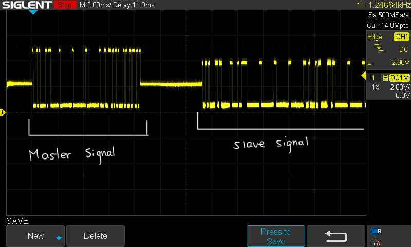

# Modbus RTU Signal Analysis Using SIGLENT SDS1000X-E

## Signal Analysis Procedure Summary

- The signal was measured using **Channel 1** of the oscilloscope.

### Connection Setup:
- **Probe tip (CH1)** connected to **RS-485 A+ (Data +)**.
- **Probe ground** connected to **RS-485 GND**.

### Oscilloscope Settings:
- **Horizontal scale (Time/Div):** 2000 µs (2 ms/div)
- **Vertical scale (Volts/Div):** 2 V

### Trigger Configuration:
- **Type:** Edge
- **Slope:** Rising
- **Trigger level:** Adjusted slightly above 0 V to detect valid signal transitions.
- **Mode:** Single (to capture one complete communication event)

### Purpose of Configuration:
- Capturing the **first rising edge** of the signal, which marks the start of the master’s request.
- This setup allows clear observation of both the **Modbus master request** followed by the **slave response** in the same waveform capture.

### Result:
- The oscilloscope successfully displayed the Modbus RTU master request followed by the slave response, making it possible to visually analyze the communication sequence and signal timing.

