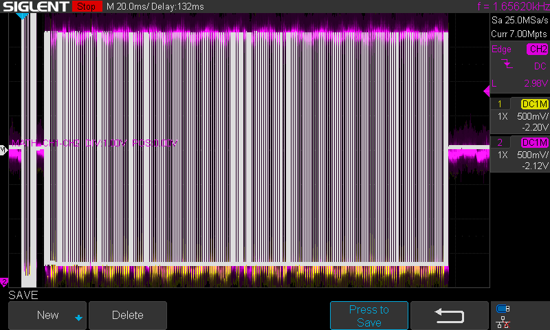

# Modbus RTU Signal Analysis Using SIGLENT SDS1000X-E

## Signal Analysis Procedure Summary (Channel 1)

- The signal was measured using **Channel 1** of the oscilloscope.

### Connection Setup:
- **Probe tip (CH1)** connected to **RS-485 A+ (Data +)**.
- **Probe ground** connected to **RS-485 GND**.

### Oscilloscope Settings:
- **Horizontal scale (Time/Div):** 2000 µs (2 ms/div)
- **Vertical scale (Volts/Div):** 2 V

### Trigger Configuration:
- **Type:** Edge
- **Slope:** Rising
- **Trigger level:** Adjusted slightly above 0 V to detect valid signal transitions.
- **Mode:** Single (to capture one complete communication event)

### Purpose of Configuration:
- Capturing the **first rising edge** of the signal, which marks the start of the master’s request.
- This setup allows clear observation of both the **Modbus master request** followed by the **slave response** in the same waveform capture.

### Result:
- The oscilloscope successfully displayed the Modbus RTU master request followed by the slave response, making it possible to visually analyze the communication sequence and signal timing.

### CSV File Description

The CSV file saved from the oscilloscope contains raw waveform data captured during a Modbus RTU communication event. Specifically, it records both the **master request** and the **slave response** signals measured on the RS-485 A+ line.
[Download Modbus data.zip](Modbus%20data.zip)

### CSV Structure:
- **First column:** Time values in seconds or microseconds (depending on oscilloscope settings).
- **Second column:** Voltage values in volts, corresponding to the signal level at each time point.

### What the Data Represents:
- The initial portion of the data corresponds to the **Modbus master request frame**.
- Following a brief idle period, the second portion corresponds to the **Modbus slave response frame**.
- By graphing this data in software like Excel, LibreOffice Calc, or MATLAB, you can visualize the exact timing, pulse width, and signal integrity of both communication frames.

### Notes:
- Time resolution depends on the horizontal scale and memory depth set during capture.
- Voltage values reflect single-ended measurement between RS-485 A+ and ground.

## Signal Analysis Procedure Summary (Differential Method CH1 − CH2)

- The signal was measured using **Channel 1 and Channel 2** of the oscilloscope in differential mode.

### Connection Setup:
- **CH1 probe tip** connected to **RS-485 A+ (Data +)**.
- **CH2 probe tip** connected to **RS-485 B− (Data −)**.
- **Both probe grounds** connected to **RS-485 GND**.

### Oscilloscope Settings:
- **Math Function:** CH1 − CH2 enabled to display the true RS-485 differential signal.
- **Horizontal scale (Time/Div):** 2000 µs (2 ms/div).
- **Vertical scale (Volts/Div):** 2 V (adjust according to signal amplitude).

### Trigger Configuration:
- **Type:** Edge.
- **Slope:** Rising.
- **Trigger Source:** CH1 (or Math, depending on oscilloscope model).
- **Trigger level:** Adjusted slightly above 0 V to detect valid differential signal transitions.
- **Mode:** Single (to capture one complete communication event).

### Purpose of Configuration:
- Capturing the **first rising edge** of the differential signal, which marks the start of the Modbus master’s request.
- This setup allows clear observation of both the **Modbus master request** followed by the **slave response** with proper differential signal behavior.

### Result:
- The oscilloscope successfully displayed the Modbus RTU master request followed by the slave response using the differential signal (CH1 − CH2), making it possible to visually analyze the communication sequence and signal timing while reducing common-mode noise.

## CSV File Description (CH1, CH2, and Differential Signal)

The CSV file saved from the oscilloscope contains raw waveform data captured during a Modbus RTU communication event using **Channel 1**, **Channel 2**, and the **Math (CH1 − CH2)** function for differential analysis.

### CSV Structure:
- **First column:** Time values in seconds
- **Second column:** Voltage values from **Channel 1 (RS-485 A+)**.
- **Third column:** Voltage values from **Channel 2 (RS-485 B−)**.
- **Fourth column:** Time values in seconds
- **Fifth column:** Calculated voltage values from **Math CH1 − CH2 (differential signal)**.

### What the Data Represents:
- **Channel 1 (CH1):** Measures the voltage level on RS-485 A+ relative to ground.
- **Channel 2 (CH2):** Measures the voltage level on RS-485 B− relative to ground.
- **Math CH1 − CH2:** Shows the true differential voltage used in RS-485 Modbus RTU communication.

### How to Use the Data:
- By graphing the **differential column (Math CH1 − CH2)**, you can clearly observe:
  - The Modbus master request.
  - The Modbus slave response.
  - Voltage levels and timing between both events.
- Comparing **CH1** and **CH2** columns helps verify signal symmetry and detect possible line issues (such as reflections or asymmetry).

### Notes:
- Time resolution and voltage precision depend on oscilloscope settings used during capture.
- Differential measurement helps reduce common-mode noise effects and gives a clearer view of RS-485 communication behavior.

